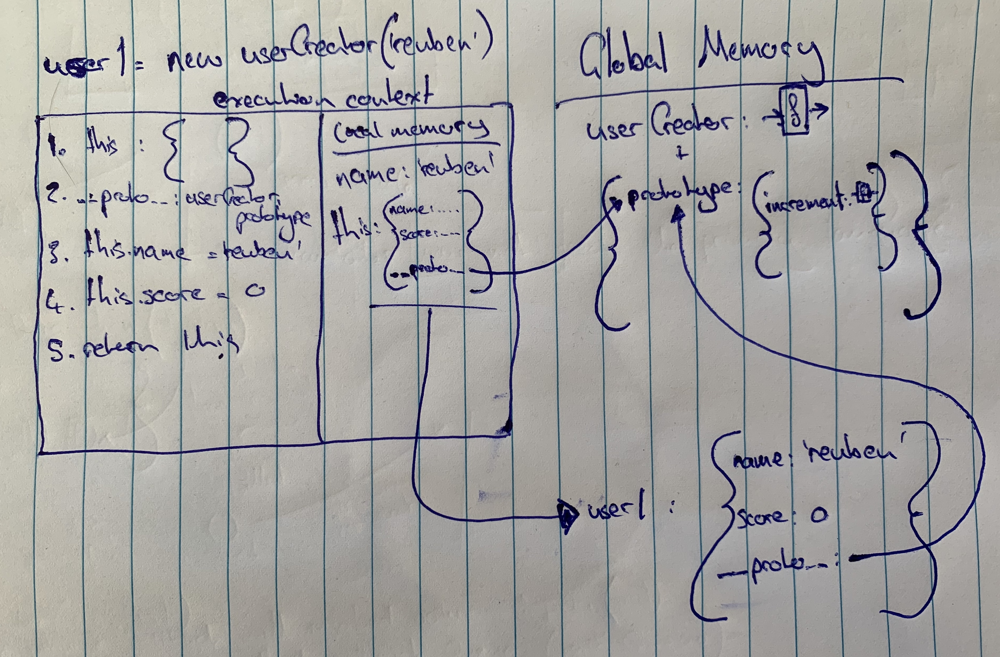

#### Functions

- Execution context is what is created when a function is run and consists of two parts:
  1. The thread of execution
  1. The memory reserved for the function's context - this is where variables and other declarations are stored

#### Call Stack

- The call stack is JavaScript's reference to where the thread of execution is; what functions are running
- Three core components of JavaScript are:
  1. Thread of execution
  1. Memory to store data
  1. The call stack

#### Higher Order Functions

- Suppose you have the following two functions

  ```js
  const multiplyBy2 = (arr) => {
    let result = [];
    for (let i = 0; i < arr.length; i++) {
      result.push(arr[i] * 2);
    }
    return result;
  };

  const divideBy2 = (arr) => {
    let result = [];
    for (let i = 0; i < arr.length; i++) {
      result.push(arr[i] / 2);
    }
    return result;
  };
  ```

- You can use a higher order function to generalise the logic that's executed on each value in the array (essentially I've just implemented `map`)

  ```js
  const map = (arr, cb) => {
    let result = [];
    for (let i = 0; i < arr.length; i++) {
      result.push(cb(arr[i]));
    }
    return result;
  };

  let multipliedBy2 = map([1, 2, 3], (num) => num * 2); // [2, 4, 6]
  let dividedBy2 = map([1, 2, 3], (num) => num / 2); // [0.5, 2, 3]
  ```

#### Callbacks & Higher Order Functions

- Functions in JavaScript are first class objects - they can co-exist with and be treated like any other JavaScript object.
- Any function in JavaScript that receives a function as an argument or returns a function is considered a higher order function.

#### Pair Programming

- **Researcher**: Avoids blocks by reading everything they can find on their block/bug
- **Stackoverflower**: Uses code snippets to fix bugs without knowing how they work
- **Pair programming**: The most effective way to grow as a software engineer

#### Function Closure

- Closure is really quite cool. The function `counterContext` declares a local varibale `count`. It then returns two functions that have access to the `count` variable even after the invocation of `counterContext` has finished. This variable `count` is stored within a scope that the two returned functions have access to. Note that the scope is unique for each instance that the `counterContext` function is invocated.

  ```js
  const counterContext = () => {
    let count = 0;
    return {
      increment: () => count++,
      print: () => console.log(count),
    };
  };

  const counter = counterContext();
  const counter2 = counterContext();
  counter.increment();
  counter.print(); // ouputs 1
  counter.increment();
  counter.print(); // outputs 2
  counter2.increment();
  counter2.print(); // outputs 1
  counter.print(); // outputs 2
  ```

- Any data that is not used by the enclosed functionality is stripped out during optimisation. So, `unused` will not exist within the closure's scope.
  ```js
  const counterContext = () => {
    let unused = 10;
    let count = 0;
    return {
      increment: () => count++,
      print: () => console.log(count),
    };
  };
  ```
- A function has access to all of the data within the scope that it was declared. A technical name for the data that is returned with the functions that reference it is Persistant Lexical Scope Reference Data (PLSRD)
- Lexical scope really means that a function has access to the data within the same scope that it was defined.

#### Practical Applications

- once; where by you can ensure that a function is only run once
  ```js
  // This isn't a fantastic example - find something better
  const onceClosure = () => {
    let run = false;
    const fn = () => {
      if (!run) {
        console.log("I've been run!");
        run = true;
      } else {
        console.log("I can only be run once");
      }
    };
    return fn;
  };
  let once = onceClosure();
  once(); // outputs I've been run!
  once(); // outputs I can only be run once
  ```
- memoize; where by a function remembers it's evaluation for each set of inputs and outputs, meaning, the function never has to execute the same logic twice for the same inputs

  ```js
  const multiplyBy5 = () => {
    let history = {};
    const fn = (num) => {
      if (!history[num]) {
        console.log("Crunching the numbers...");
        history[num] = num * 5;
      } else {
        console.log("I know that one");
      }
      return history[num];
    };
    return fn;
  };

  let by5 = multiplyBy5();
  by5(5); // outputs Crunching the numbers... - returns 25
  by5(5); // outputs I know that one - returns 25
  ```

- Iterators and generators; use lexical scoping and closure to achieve the most contemporary patterns for handling data in JavaScript
- Module pattern; preserve state for the life of an application without polluting the global namespace
- Asynchronous JavaScript; callbacks and promises rely on closure to persist state in an asynchronous environment

#### Closure Exercises - http://csbin.io/closures

```js
// CHALLENGE 1
function createFunction() {
  return () => console.log("hello");
}

// /*** Uncomment these to check your work! ***/
const function1 = createFunction();
function1(); // => should console.log('hello');

// CHALLENGE 2
function createFunctionPrinter(input) {
  return () => console.log(input);
}

// /*** Uncomment these to check your work! ***/
const printSample = createFunctionPrinter("sample");
printSample(); // => should console.log('sample');
const printHello = createFunctionPrinter("hello");
printHello(); // => should console.log('hello');

// CHALLENGE 3
function outer() {
  let counter = 0; // this variable is outside incrementCounter's scope
  function incrementCounter() {
    counter++;
    console.log("counter", counter);
  }
  return incrementCounter;
}

const willCounter = outer();
const jasCounter = outer();

// Uncomment each of these lines one by one.
// Before your do, guess what will be logged from each function call.

// /*** Uncomment these to check your work! ***/
willCounter();
willCounter();
willCounter();

jasCounter();
willCounter();

function addByX(x) {
  return (y) => x + y;
}

// /*** Uncomment these to check your work! ***/
const addByTwo = addByX(2);
addByTwo(1); // => should return 3
addByTwo(2); // => should return 4
addByTwo(3); // => should return 5

const addByThree = addByX(3);
addByThree(1); // => should return 4
addByThree(2); // => should return 5

const addByFour = addByX(4);
addByFour(4); // => should return 8
addByFour(5); // => should return 9

// CHALLENGE 4
function once(func) {
  let result;
  return (x) => {
    if (!result) result = func(x);
    return result;
  };
}

// /*** Uncomment these to check your work! ***/
const onceFunc = once(addByTwo);
console.log(onceFunc(4)); // => should log 6
console.log(onceFunc(10)); // => should log 6
console.log(onceFunc(9001)); // => should log 6

// CHALLENGE 5
function after(count, func) {
  let called = 0;
  return () => {
    if (++called >= count) func();
  };
}

// /*** Uncomment these to check your work! ***/
const called = function () {
  console.log("hello");
};
const afterCalled = after(3, called);
afterCalled(); // => nothing is printed
afterCalled(); // => nothing is printed
afterCalled(); // => 'hello' is printed

// CHALLENGE 7
function rollCall(names) {
  return () => {
    if (names.length) {
      console.log(names.shift());
    } else console.log("Everyone accounted for");
  };
}

// /*** Uncomment these to check your work! ***/
const rollCaller = rollCall(["Victoria", "Juan", "Ruth"]);
rollCaller(); // => should log 'Victoria'
rollCaller(); // => should log 'Juan'
rollCaller(); // => should log 'Ruth'
rollCaller(); // => should log 'Everyone accounted for'

// CHALLENGE 8
function saveOutput(func, magicWord) {
  let results = {};
  return (x) => {
    if (x === magicWord) return results;
    results[x] = func(x);
    return results[x];
  };
}

// /*** Uncomment these to check your work! ***/
const multiplyBy2 = function (num) {
  return num * 2;
};
const multBy2AndLog = saveOutput(multiplyBy2, "boo");
console.log(multBy2AndLog(2)); // => should log 4
console.log(multBy2AndLog(9)); // => should log 18
console.log(multBy2AndLog("boo")); // => should log { 2: 4, 9: 18 }

// CHALLENGE 9
function cycleIterator(array) {
  let idx = 0;
  return () => {
    if (idx === array.length) idx = 0;
    return array[idx++];
  };
}

// /*** Uncomment these to check your work! ***/
const threeDayWeekend = ["Fri", "Sat", "Sun"];
const getDay = cycleIterator(threeDayWeekend);
console.log(getDay()); // => should log 'Fri'
console.log(getDay()); // => should log 'Sat'
console.log(getDay()); // => should log 'Sun'
console.log(getDay()); // => should log 'Fri'

// CHALLENGE 10
function defineFirstArg(func, arg) {
  return (small) => {
    return func(arg, small);
  };
}

// /*** Uncomment these to c1heck your work! ***/
const subtract = function (big, small) {
  return big - small;
};
const subFrom20 = defineFirstArg(subtract, 20);
console.log(subFrom20(5)); // => should log 15

// CHALLENGE 11
function dateStamp(func) {
  return (input) => {
    return { date: Date.now(), output: func(input) };
  };
}

// /*** Uncomment these to check your work! ***/
const stampedMultBy2 = dateStamp((n) => n * 2);
console.log(stampedMultBy2(4)); // => should log { date: (today's date), output: 8 }
console.log(stampedMultBy2(6)); // => should log { date: (today's date), output: 12 }

// CHALLENGE 12
function censor() {
  let result = {};
  return (a, b) => {
    if (a && b) result[a] = b;
    else if (a) {
      Object.keys(result).forEach(
        (key) => (a = a.replace(key, result[key]))
      );
      return a;
    }
  };
}

// /*** Uncomment these to check your work! ***/
const changeScene = censor();
changeScene("dogs", "cats");
changeScene("quick", "slow");
console.log(changeScene("The quick, brown fox jumps over the lazy dogs.")); // => should log 'The slow, brown fox jumps over the lazy cats.'

// CHALLENGE 13
function createSecretHolder(secret) {
  return {
    getSecret: () => {
      return secret;
    },
    setSecret: (val) => (secret = val),
  };
}

// /*** Uncomment these to check your work! ***/
const obj = createSecretHolder(5);
console.log(obj.getSecret()); // => returns 5
obj.setSecret(2);
console.log(obj.getSecret()); // => returns 2

// CHALLENGE 14
function callTimes() {
  let called = 0;
  return () => {
    return ++called;
  };
}

// /*** Uncomment these to check your work! ***/
let myNewFunc1 = callTimes();
let myNewFunc2 = callTimes();
myNewFunc1(); // => 1
myNewFunc1(); // => 2
myNewFunc2(); // => 1
myNewFunc2(); // => 2

// CHALLENGE 15
function russianRoulette(num) {
  let counter = 0;
  return () => {
    if (++counter < num) return "click";
    else if (counter === num) return "bang";
    else return "reload to play again";
  };
}

// /*** Uncomment these to check your work! ***/
const play = russianRoulette(3);
console.log(play()); // => should log 'click'
console.log(play()); // => should log 'click'
console.log(play()); // => should log 'bang'
console.log(play()); // => should log 'reload to play again'
console.log(play()); // => should log 'reload to play again'

// CHALLENGE 16
function average() {
  let history = [];
  let average = 0;
  return (num) => {
    if (num) {
      history.push(num);
      average = history.reduce((acc, val) => acc + val) / history.length;
    }
    return average;
  };
}

// /*** Uncomment these to check your work! ***/
const avgSoFar = average();
console.log(avgSoFar()); // => should log 0
console.log(avgSoFar(4)); // => should log 4
console.log(avgSoFar(8)); // => should log 6
console.log(avgSoFar()); // => should log 6
console.log(avgSoFar(12)); // => should log 8
console.log(avgSoFar()); // => should log 8

// CHALLENGE 17
function makeFuncTester(arrOfTests) {
  return (cb) => {
    return !arrOfTests.map((test) => cb(test[0]) === test[1]).includes(false);
  };
}

// /*** Uncomment these to check your work! ***/
const capLastTestCases = [];
capLastTestCases.push(["hello", "hellO"]);
capLastTestCases.push(["goodbye", "goodbyE"]);
capLastTestCases.push(["howdy", "howdY"]);
const shouldCapitalizeLast = makeFuncTester(capLastTestCases);
const capLastAttempt1 = (str) => str.toUpperCase();
const capLastAttempt2 = (str) => str.slice(0, -1) + str.slice(-1).toUpperCase();
console.log(shouldCapitalizeLast(capLastAttempt1)); // => should log false
console.log(shouldCapitalizeLast(capLastAttempt2)); // => should log true

// CHALLENGE 18
function makeHistory(limit) {
  let history = [];
  return (input) => {
    if (input !== "undo") {
      history.push(input);
      if (history.length > limit) {
        history.shift();
      }
      return `${input} done`;
    } else {
      return history.length ? `${history.pop()} undone` : "nothing to undo";
    }
  };
}

// /*** Uncomment these to check your work! ***/
const myActions = makeHistory(2);
console.log(myActions("jump")); // => should log 'jump done'
console.log(myActions("undo")); // => should log 'jump undone'
console.log(myActions("walk")); // => should log 'walk done'
console.log(myActions("code")); // => should log 'code done'
console.log(myActions("pose")); // => should log 'pose done'
console.log(myActions("undo")); // => should log 'pose undone'
console.log(myActions("undo")); // => should log 'code undone'
console.log(myActions("undo")); // => should log 'nothing to undo'

// CHALLENGE 19
function blackjack(array) {
  return (num1, num2) => {
    let counter = 0;
    let bust = false;
    let sum = 0;
    return () => {
      if (!bust) {
        if (++counter === 1) {
          sum = num1 + num2;
        } else {
          sum += array.shift();
          if (sum > 21) {
            bust = true;
            return "bust";
          }
        }
        return sum;
      }
      return "you are done!";
    };
  };
}

// /*** Uncomment these to check your work! ***/

// /*** DEALER ***/
const deal = blackjack([
  2,
  6,
  1,
  7,
  11,
  4,
  6,
  3,
  9,
  8,
  9,
  3,
  10,
  4,
  5,
  3,
  7,
  4,
  9,
  6,
  10,
  11,
]);

/*** PLAYER 1 ***/
const i_like_to_live_dangerously = deal(4, 5);
console.log(i_like_to_live_dangerously()); // => should log 9
console.log(i_like_to_live_dangerously()); // => should log 11
console.log(i_like_to_live_dangerously()); // => should log 17
console.log(i_like_to_live_dangerously()); // => should log 18
console.log(i_like_to_live_dangerously()); // => should log 'bust'
console.log(i_like_to_live_dangerously()); // => should log 'you are done!'
console.log(i_like_to_live_dangerously()); // => should log 'you are done!'

// /*** BELOW LINES ARE FOR THE BONUS ***/

// /*** PLAYER 2 ***/
const i_TOO_like_to_live_dangerously = deal(2, 2);
console.log(i_TOO_like_to_live_dangerously()); // => should log 4
console.log(i_TOO_like_to_live_dangerously()); // => should log 15
console.log(i_TOO_like_to_live_dangerously()); // => should log 19
console.log(i_TOO_like_to_live_dangerously()); // => should log 'bust'
console.log(i_TOO_like_to_live_dangerously()); // => should log 'you are done!
console.log(i_TOO_like_to_live_dangerously()); // => should log 'you are done!

/*** PLAYER 3 ***/
const i_ALSO_like_to_live_dangerously = deal(3, 7);
console.log(i_ALSO_like_to_live_dangerously()); // => should log 10
console.log(i_ALSO_like_to_live_dangerously()); // => should log 13
console.log(i_ALSO_like_to_live_dangerously()); // => should log 'bust'
console.log(i_ALSO_like_to_live_dangerously()); // => should log 'you are done!
console.log(i_ALSO_like_to_live_dangerously()); // => should log 'you are done!
```

#### Web API Example

- read https://jakearchibald.com/2015/tasks-microtasks-queues-and-schedules/

#### Callback hell & async exercises - http://csbin.io/async
```js
/* CHALLENGE 1 */

function sayHowdy() {
  console.log('Howdy');
}

function testMe() {
  setTimeout(sayHowdy, 0);
  console.log('Partnah');
}
// After thinking it through, uncomment the following line to check your guess!
// testMe(); // what order should these log out? Howdy or Partnah first?


/* CHALLENGE 2 */

function delayedGreet() {
  const fn = () => console.log('welcome');
  setTimeout(fn, 3000);
  // ADD CODE HERE
}
// Uncomment the following line to check your work!
// delayedGreet(); // should log (after 3 seconds): welcome


/* CHALLENGE 3 */

function helloGoodbye() {
  const fn = () => console.log('good bye');
  console.log('hello');
	setTimeout(fn, 3000)
}
// Uncomment the following line to check your work!
// helloGoodbye(); // should log: hello // should also log (after 3 seconds): good bye


/* CHALLENGE 4 */

function brokenRecord() {
  // ADD CODE HERE
}
// Uncomment the following line to check your work!
// brokenRecord(); // should log (every second): hi again


/* CHALLENGE 5 */

function limitedRepeat() {
  let fn = () => console.log('hi for now');
  let id = setInterval(fn, 1000);
  let clear = () => clearInterval(id);
  setTimeout(clear, 5000);
  // ADD CODE HERE
}
// Uncomment the following line to check your work!
// limitedRepeat(); // should log (every second, for 5 seconds): hi for now


/* CHALLENGE 6 */

function everyXsecsForYsecs(cb, interval, duration) {
  let id = setInterval(cb, interval * 1000);
  let clear = () => clearInterval(id);
  setTimeout(clear, duration * 1000);
}
// Uncomment the following lines to check your work!
function theEnd() {
  console.log('This is the end!');
}
// everyXsecsForYsecs(theEnd, 2, 20); // should invoke theEnd function every 2 seconds, for 20 seconds): This is the end!


/* CHALLENGE 7 */

function delayCounter(target, wait) {
  let count = 0;
  return () => {
    let fn = () => {
      console.log(++count);
    }
    let id = setInterval(fn, wait);
    let clear = () => clearInterval(id);
    setTimeout(clear, wait * target);
  }
}

// UNCOMMENT THESE TO TEST YOUR WORK!
// const countLogger = delayCounter(3, 1000)
// countLogger();
// After 1 second, log 1
// After 2 seconds, log 2
// After 3 seconds, log 3

/* CHALLENGE 8 */

function promised (val) {
  return new Promise((resolve, reject) => {
    setTimeout(() => resolve(val), 2000)
  })
}

// UNCOMMENT THESE TO TEST YOUR WORK!
// const createPromise = promised('wait for it...');
// createPromise.then((val) => console.log(val)); 
// will log "wait for it..." to the console after 2 seconds

/* CHALLENGE 9 */

class SecondClock {
  constructor(cb) {
    this.seconds = 0;
    this.cb = cb;
    this.intervalId;
  }
  start() {
    const fn = () => {
      if (++this.seconds > 60) this.seconds = 1;
      this.cb(this.seconds);
    }
    this.intervalId = setInterval(fn, 1000);
  }
  reset() {
    clearInterval(this.intervalId);
    this.seconds = 0;
  }
}

// UNCOMMENT THESE TO TEST YOUR WORK!
// const clock = new SecondClock((val) => { console.log(val) });
// console.log("Started Clock.");
// clock.start();
// setTimeout(() => {
//     clock.reset();
//     console.log("Stopped Clock after 62 seconds.");
// }, 62000);

/* CHALLENGE 10 */

function debounce(callback, interval) {
  let canRun = true;
  return () => {
    if (canRun) {
      canRun = false;
      return callback();
    } else setTimeout(() => canRun = true, interval)
  }
  // ADD CODE HERE
}

// UNCOMMENT THESE TO TEST YOUR WORK!
function giveHi() { return 'hi'; }
const giveHiSometimes = debounce(giveHi, 3000);
console.log(giveHiSometimes()); // -> 'hi'
setTimeout(function() { console.log(giveHiSometimes()); }, 2000); // -> undefined
setTimeout(function() { console.log(giveHiSometimes()); }, 4000); // -> undefined
setTimeout(function() { console.log(giveHiSometimes()); }, 8000); // -> 'hi'
```

#### Web APIs & Promises Example: Microtask Queue
- Reference code
  ```js
  function display(data) { console.log(data) };
  function printHello() { console.log('Hello!') };
  function blockFor300ms() { /*Blocking code*/ };

  setTimeout(printHello, 0);
  const futureData = fetch('url');
  futureData.then(display);
  blockFor300ms();
  console.log('Me first');
  ```
- Diagram

1. Declare `display` function
1. Declare `printHello` function
1. Declare `blockFor300ms` function
1. Invoke `setTimeout(printHello, 0)`
    - This calls the web APIs `setTimeout` function, passing a reference to `printHello` and the duration to delay the running of this function. When the duration has passed, the function refernce will be pushed to the `task queue`.
1. `futureData` is assigned the value returned by invoking `fetch`, which returns a promise object. The promise looks something like
    ```js
    futureData === {
      value: ...,
      onFulfilled: [],
      onRejection: []
    }
    ```
    `fetch` is a part of the brower's web API, which starts a network request in the background to get some data from the server at `url` - when this request returns some data, that data is automatically assigned to the promise's value property - `futureData.value`- fetch maintains a reference to the promise that it returned.
1. `futureData.then(display)` is invoked and what this actually does is assigns a reference to the callback that will be run when the data from the network request comes back and is assigned to the promise's value property - this reference is stored within the promise's `onFulfilled` property - `futureData.onFulfilled` and the callback is automatically passed the returned value as a parameter. When the data from the server comes back and is assigned to `futureData.value`, the callback within `futureData.onFulfilled` is pushed to the `micro task queue`.
1. Invoke `blockFor300ms`, which pushes this function to the `call stack`. If you're wondering why this is running before the `printHello` function passed into `setTimeout` or even before `display` is invoked (perhaps the promise could have resolved), then here goes - all instructions in the global context are run before anything that's situated on the `task queue` or the `micro task queue` - once the `call stack` is empty, the `event loop` will check first the `micro task queue` for anything that needs to be run and if it's empty and only if it's empty, it will then check the `task queue`.
1. `console.log('Me first')` is run.
1. The `call stack` is now empty, which means the event loop checks the `micro task queue` (let's assume the `featureData` promise has resolved) - it finds the `display` function reference there, pops it off the queue and onto the `call stack`, invoking it with the data within the resolved promise as its parameter - `display(futureData.value)`
1. `display` is invoked and run so now the `event loop` checks the `micro task queue` again - it's empty, so then it refers to the `task queue` and finds a reference to `printHello` - pops it off the `task queue` and onto the `call stack` - `print hello` is now invoked and the `call stack` is empty, as are the `micro task queue` and the `task queue`
1. Order of outputs
  - `Me first`
  - `console.log(data)` - from invocation of `display`
  - `Hello`

#### Factory Functions
- You can declare factory functions to enclose repeated logic pertaining to creating an oject
- ```js
    function createUser(name) {
      return {
        name,
        score: 0,
        incrementScore: function() { this.score++; }
      }
    };

    let userOne = createUser('Reuben');
    let userTwo = createUser('Bridget');
    userTwo.increment();
    console.log(userTwo.score); // outputs 1
  ```
- The problem with the above approach is that every object instance created by calling `createUser` has this function `incrementScore` declaration attached to it - meaning if you've got 100 users created with this factory function, you have 100 `incrementScore` functions persisted in memory. Another problem with the above approach is that you can't easily all of the objects returned by `createUser`.
- ```js
    function createUser(name) {
      const result = Object.create(userFunctions);
      result.name = name;
      result.score = 0;
      return result;
    };

    const userFunctions = {
      incrementScore: function() { this.score++; }
    }
    let userOne = createUser('Reuben');
    let userTwo = createUser('Bridget');
    userTwo.incrementScore();
  ```
- The approach above solves the issue of the previous approach by using `Object.create` - notice that the `userFunctions` object is passed into `Object.create`. Now every object created by `createUser` has a prototypal link to the `userFunctions` object, where that reference is stored within a hidden property called `__proto__`. So when `userTwo.increment()` is invoked, the JavaScript interpretor first checks the `userTwo` object for the `incrementScore` property, doesn't find it, so then refers to the `userFunctions` object that was passed into `Object.create` and locates the function!
- `this` in the increment function is a reference to the object that calls it, so `userTwo.incrementScore()`, where `userTwo` is referenced by `this` (the object to the left of the dot (.))
- All objects in JavaScript have a `__proto__` property by default, which defaults to linking to Object.prototype
- In relation to the above:
  ```js
  const userFunctions = {
    incrementScore: function() {
      function increment() {
        this.score++; 
      } 
      increment();
    }
  }
  ```
  Wrapping the increment logic within another function will not behave as you might expect. `this` within the `increment` function no longer refers to the object that calls `incrementScore`, but rather the global `window` object =\
- The above problem can be solved with the use of an arrow function:
  ```js
  const userFunctions = {
    incrementScore: function() {
      const increment = () => {
        this.score++; 
      } 
      increment();
    }
  }
  ```
  Now the inner function gets its `this` set by where it was saved - it's a lexically scoped `this`

#### `new` Keyword
```js
  function userCreator(name) {
    this.name = name;
    this.score = 0;
  }

  userCreator.prototype.increment = function() {
    this.score++;
  }

  let user1 = new userCreator('Reuben');
```
- All of the previous examples can be simplified by using the `new` keyword. When you use `new` in front of the `userCreator` function, the function has an implicit variable, or object, inside called `this`.
- Every function is really just an object and every function created with the `function` keyword has a prototype property attached to it, which is an object. So in the above example, we can use the prototype property of the `userCreator` function to store shared functionality between all instances created by calling `new userCreator`. Note the each isntnance created has a `__proto__` property on in, which refers to the `prototype` on `userCreator`
- 
    - The first thing that happens is we create a function with the label `userCreator` - using the `function` keyword, this results in the function + object combination, where the object has a property on it called `prototype`, which is also an object
    - The next thing that happens is that on the `userCreator` function's object `prototype`, a method is defined on the property `increment`
    - Then, we declare a variable `user1` and assign it the value returned by calling the `userCreator` function with the `new` keyword
        - A new execution context for the runtime of `userCreator` is created, where in the local memory of that execution context, we have the `name` parameter with its associated value
        - The first thing that happens in this execution context is related to what the `new` keyword does - it creates an object with the label `this`
        - It then adds the property `__proto__` to `this`, which is a reference back to the calling functions `prototype` property on the function's object (the calling function here is `userCreator`)
        - The remainder of the function's statements are executed and at the end of the function, the `this` object is returned
    - `user1` is an object with a property `__proto__`, which references the `prototype` property on the instantiating function's object
    - Calling `user1.increment()` will cause the JavaScript interpretor to check `user1` for the method `increment`, which is doesn't find, it then follows the prototype chain up through the reference of `__proto__` to find the function.

#### `class` Keyword
```js
  class UserCreator {
    constructor(name) {
      this.name = name;
      this.score = 0;
    }

    increment() {
      this.score++;
    }
  }

  let user1 = new userCreator('Reuben');
```
- The `class` keyword is purely syntactic sugar and under the hood, this implementation behaves in exactly the same manner as the previous, though this time, we get to declare the functions all within the same block rather than specifying them as properties on `prototype` - `userCreator.prototype.increment ...`